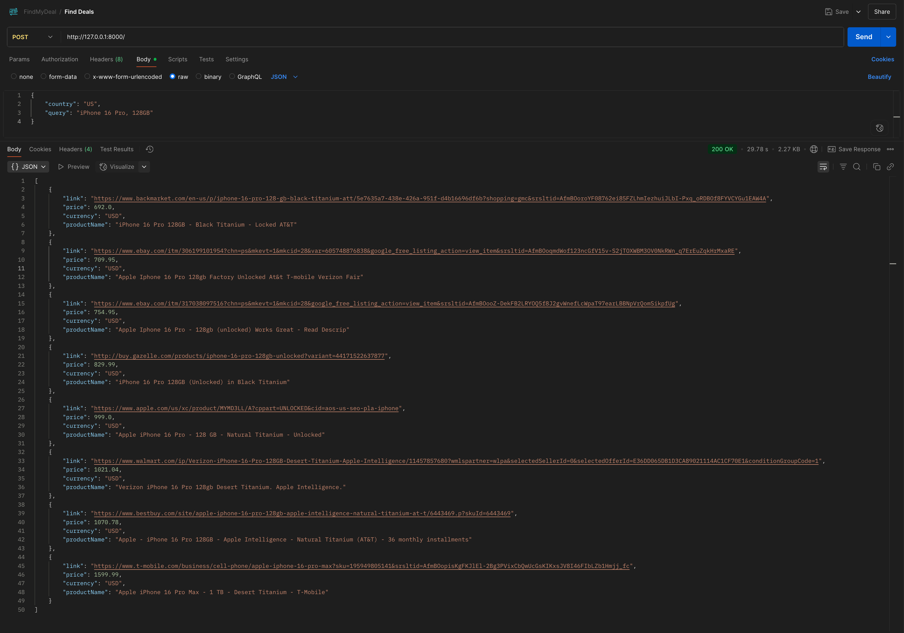
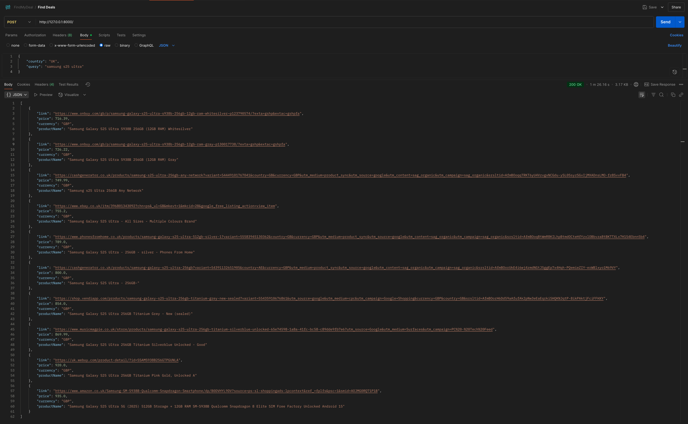

# FindMyDeal

API to find the best deals for products across different countries with smart relevance filtering.

## Requirements

- Python 3.10+
- SerpAPI account and API key

## Get Started

1. **Clone the repository:**
   ```bash
   git clone https://github.com/yourusername/FindMyDeal.git
   cd FindMyDeal
   ```

## Setup

1. **Install dependencies:**
   ```bash
   pip install -r requirements.txt
   ```

2. **Create `.env` file:**
   ```bash
   SERPAPI_API_KEY=your_serpapi_key_here
   ```

3. **Get SerpAPI key:**
   - Sign up at [serpapi.com](https://serpapi.com)
   - Copy your API key to the `.env` file

## Run

### Option 1: Local Development
**Start the API server:**
```bash
uvicorn main:app --reload
```

### Option 2: Docker
**Build and run with Docker:**
```bash
# Build the image
docker build -t findmydeal .

# Run the container
docker run -p 8000:8000 --env-file .env findmydeal
```

**Or use Docker Compose:**
```bash
docker-compose up -d
```

**API will be available at:** `http://localhost:8000`

**Interactive docs:** `http://localhost:8000/docs`

## Test

**Example API call:**
```bash
curl -X POST "http://localhost:8000/" \
  -H "Content-Type: application/json" \
  -d '{"country": "US", "query": "iPhone 16 Pro, 128GB"}'
```

**Test script:**
```bash
python test_serpapi_parser.py
```

## Example Outputs





## Features

- Smart product relevance filtering
- Filters out accessories and damaged items  
- Multi-country support
- Localized results with country specific pricing and stores
- Price sorting (cheapest first)
- Keyword matching to ensure exact product matches